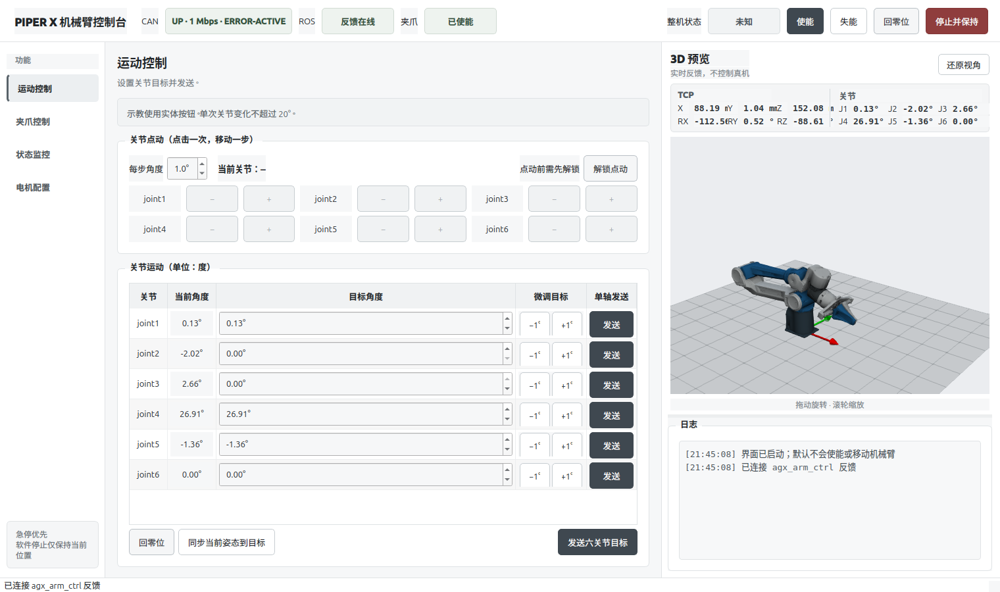

# Piper ROS 2 GUI

面向 AgileX Piper X 机械臂的 ROS 2 桌面控制界面。项目使用 PyQt5 构建，
通过 `agx_arm_ctrl` 收发 ROS 2 数据，并使用 VTK 实时显示机械臂姿态。

[](https://github.com/agilexrobotics/agx_arm_ros)



> [!WARNING]
> 本项目会向真实机械臂发送控制指令。运行前请清空工作空间、确认实体急停可用，
> 并从低速和小角度开始测试。软件停止不能替代实体急停。

## 功能

- 六关节反馈、目标控制、微调和点动
- 整机使能、失能、回零及停止保持
- 夹爪开度、夹持力和使能控制
- 控制器状态、TCP 位姿与操作日志监控
- 单关节使能、失能和硬件零点标定
- 基于官方 STL 模型的实时 3D 预览
- 目标限位、单次角度限制、反馈超时和二次确认

3D 视图只读取反馈数据，旋转或缩放模型不会控制机械臂。

## 环境

- Ubuntu 24.04
- ROS 2 Jazzy
- Python 3
- PyQt5、VTK、NumPy
- [`agx_arm_ros`](https://github.com/agilexrobotics/agx_arm_ros)
- Piper X 与 AGX Gripper

完整功能依赖配套的 `agx_arm_ctrl` 服务扩展，包括带结果的回零、单关节使能和零点标定。
请先完成驱动编译，并确认 `can0` 使用 `1 Mbps` 波特率。

## 快速启动

启动机械臂驱动：

```bash
ros2 launch agx_arm_ctrl start_single_agx_arm.launch.py \
  can_port:=can0 \
  arm_type:=piper_x \
  effector_type:=agx_gripper \
  auto_enable:=false \
  speed_percent:=5 \
  control_enabled:=false
```

新建终端，在项目目录中启动界面：

```bash
export AGX_ARM_WS=/path/to/agx_arm_ws
./run_gui.sh
```

启动后确认顶部状态：

- CAN：`UP · 1 Mbps`
- ROS：`反馈在线`
- 夹爪：`已使能` 或 `已失能`

## 基本操作

1. 固定机械臂并清空运动范围。
2. 点击“使能”，等待当前姿态同步到目标值。
3. 选择单个关节，以小角度进行微调或点动。
4. 确认反馈正常后，再执行多关节或夹爪动作。
5. 操作完成后扶稳机械臂，再执行失能。

“回零位”会将六个关节移动到 `0 rad`，不等于重新标定编码器。
“设零”会永久修改控制器保存的硬件零点，只应在机械零位确实错误时使用。

## 测试

逻辑测试：

```bash
source /opt/ros/jazzy/setup.bash
source "$AGX_ARM_WS/install/setup.bash"
python3 -m pytest -q
```

无真机界面检查：

```bash
QT_QPA_PLATFORM=offscreen ./run_gui.sh --smoke-test
```
